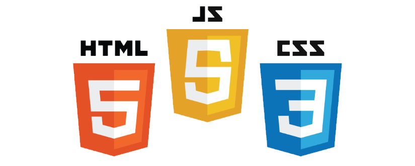

<h1 align="center">
   
    
    Proyectos Front End
    
</h1>

## Repositorio con proyectos de desarrollo Front End

## Proyectos:

1. **Landing Page with GSAP Animations** - [Ver Proyecto](https://jfelixzuniga.github.io/Frontend-Projects/Landing-Page-animation/)
2. **Responsive Vertical Timeline** - [Ver Proyecto](https://jfelixzuniga.github.io/Frontend-Projects/Timeline/)
3. **Landing Page with Tailwind** - [Ver Proyecto](https://jfelixzuniga.github.io/Frontend-Projects/Super-Mario-World-Tailwind/)
4. **Toggle Button | Dark and Light Mode** - [Ver Proyecto](https://jfelixzuniga.github.io/Frontend-Projects/ToggleButton-DarkMode/)
5. **CSS 3D Text Animation Effects** - [Ver Proyecto](https://jfelixzuniga.github.io/Frontend-Projects/3D-Text-Animation/)
6. **Basic Landing Page** - [Ver Proyecto](https://jfelixzuniga.github.io/Frontend-Projects/Desafio-01/)
7. **Basic Landing Page 2 - Iguana Page** - [Ver Proyecto](https://jfelixzuniga.github.io/Frontend-Projects/Desafio-02/)
